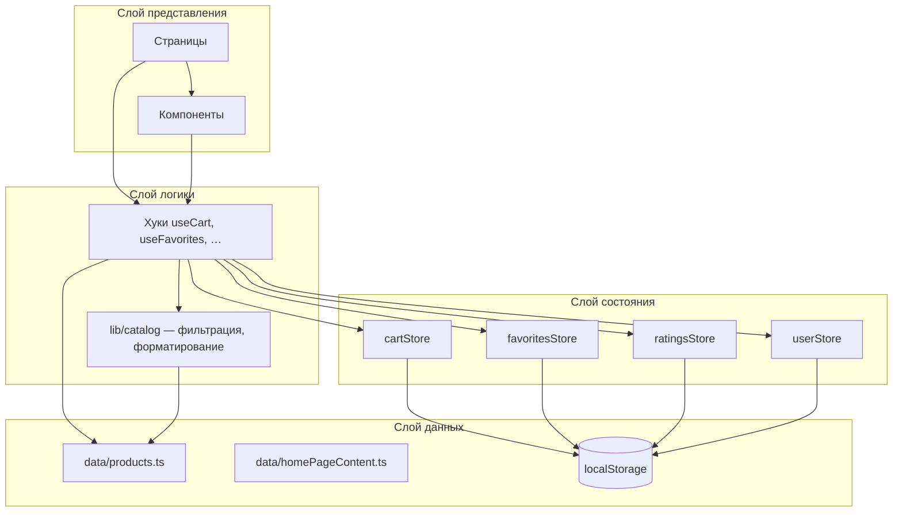
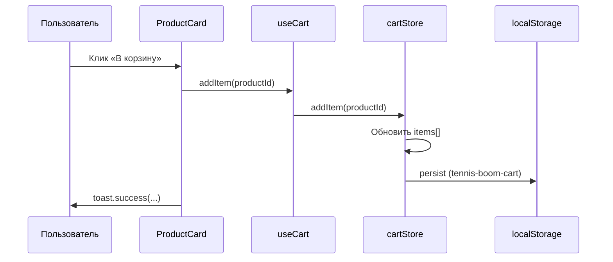
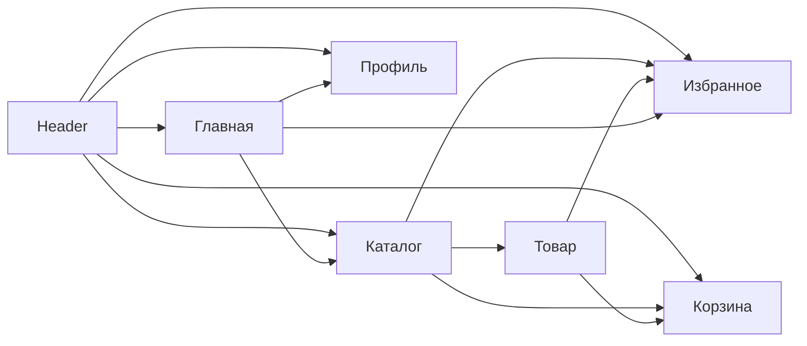

# Vibe Boom Tennis — документация проекта

> **Версия:** 0.0.0  
> **Тип:** одностраничное веб-приложение (SPA)  
> **Назначение:** демонстрационный интернет-магазин теннисной экипировки

---

## Содержание

1. [Обзор](#обзор)
2. [Технологический стек](#технологический-стек)
3. [Быстрый старт](#быстрый-старт)
4. [Структура проекта](#структура-проекта)
5. [Архитектура приложения](#архитектура-приложения)
6. [Маршрутизация](#маршрутизация)
7. [Управление состоянием](#управление-состоянием)
8. [Данные и каталог](#данные-и-каталог)
9. [Страницы приложения](#страницы-приложения)
10. [Компоненты](#компоненты)
11. [Хуки](#хуки)
12. [Типы данных](#типы-данных)
13. [Стилизация и UI](#стилизация-и-ui)
14. [Персистентность (localStorage)](#персистентность-localstorage)
15. [Сборка и качество кода](#сборка-и-качество-кода)
16. [Расширение проекта](#расширение-проекта)

---

## Обзор

**Vibe Boom Tennis** — клиентское React-приложение без бэкенда. Каталог товаров, корзина, избранное, пользовательские оценки и профиль работают полностью в браузере. Данные о товарах хранятся в статическом TypeScript-модуле; пользовательские данные сохраняются в `localStorage` через Zustand persist.

### Ключевые возможности

| Функция | Описание |
|--------|----------|
| Каталог | 16 товаров с фильтрацией по поиску, категории, бренду, цене и наличию |
| Карточка товара | Галерея, описание, рейтинг, добавление в корзину и избранное |
| Корзина | Изменение количества, подсчёт итога, очистка |
| Избранное | Список товаров по ID с компактными карточками |
| Профиль | Форма с валидацией (имя, email, телефон) |
| Оценки | Пользователь может поставить 1–5 звёзд на странице товара |
| Уведомления | Toast-сообщения при действиях пользователя |

### Ограничения текущей версии

- Нет серверного API — заказ оформить нельзя, только просмотр корзины.
- Нет аутентификации — профиль локальный.
- Изображения товаров загружаются с внешних CDN (Tennis Warehouse).
- Рейтинг товара в каталоге — статический; пользовательская оценка влияет только на странице детали.

---

## Технологический стек

| Категория | Технология | Назначение |
|-----------|------------|------------|
| Сборка | [Vite 6](https://vite.dev/) | Dev-сервер, HMR, production build |
| UI | [React 18](https://react.dev/) | Компонентный интерфейс |
| Язык | [TypeScript 5.8](https://www.typescriptlang.org/) | Статическая типизация |
| Маршруты | [React Router 6](https://reactrouter.com/) | Клиентская навигация |
| Состояние | [Zustand 5](https://zustand.docs.pmnd.rs/) | Глобальные сторы с persist |
| Стили | [Tailwind CSS 4](https://tailwindcss.com/) | Utility-first CSS |
| UI-кит | [shadcn/ui](https://ui.shadcn.com/) (Base UI + Radix) | Готовые доступные компоненты |
| Формы | [React Hook Form](https://react-hook-form.com/) + [Zod](https://zod.dev/) | Валидация профиля |
| Иконки | [Lucide React](https://lucide.dev/) | SVG-иконки |
| Уведомления | [Sonner](https://sonner.emilkowal.ski/) | Toast |

### Алиас путей

В `vite.config.ts` и `tsconfig.app.json` настроен алиас `@` → `src/`:

```ts
import { ROUTES } from '@/constants/routes'
import { useCart } from '@/hooks/useCart'
```

---

## Быстрый старт

### Требования

- Node.js 18+
- npm

### Установка и запуск

```bash
# Установка зависимостей
npm install

# Режим разработки (http://localhost:5173)
npm run dev

# Проверка типов и production-сборка
npm run build

# Просмотр production-сборки
npm run preview

# Линтинг
npm run lint
```

### Точка входа

1. `index.html` — корневой HTML, `lang="ru"`, favicon `/logo.png`.
2. `src/main.tsx` — монтирует `<App />` в `#root` внутри `StrictMode`.
3. `src/App.tsx` — `BrowserRouter` и дерево маршрутов.

---

## Структура проекта

```
tennis_boom/
├── public/                    # Статические файлы (без обработки Vite)
│   ├── logo.png               # Логотип магазина
│   ├── brands/                # Логотипы брендов (Wilson, Head, …)
│   └── products/              # Локальные изображения (при необходимости)
├── documents/                 # Документация проекта
│   └── PROJECT_DOCUMENTATION.md
├── src/
│   ├── main.tsx               # Точка входа React
│   ├── App.tsx                # Маршрутизация
│   ├── index.css              # Глобальные стили, тема, neon-эффекты
│   │
│   ├── pages/                 # Страницы (feature-based)
│   │   ├── HomePage/
│   │   ├── ProductsPage/
│   │   ├── ProductDetailPage/
│   │   ├── CartPage/
│   │   ├── FavoritesPage/
│   │   ├── UserPage/
│   │   └── NotFoundPage/
│   │
│   ├── components/
│   │   ├── layout/            # AppLayout, Header, Footer, Logo, …
│   │   ├── product/           # ProductCard, ProductFilter, CartItemRow, …
│   │   ├── icons/             # Иконки преимуществ на главной
│   │   └── ui/                # shadcn/ui примитивы (Button, Card, Form, …)
│   │
│   ├── hooks/                 # Обёртки над сторами и бизнес-логикой
│   ├── stores/                # Zustand-сторы (cart, favorites, ratings, user)
│   ├── data/                  # Статические данные (products, homePageContent)
│   ├── constants/             # routes, branding, catalog, filters
│   ├── lib/                   # Утилиты (catalog, cn)
│   └── types/                 # TypeScript-типы
│
├── components.json            # Конфигурация shadcn/ui
├── vite.config.ts
├── tsconfig.json
├── tsconfig.app.json
└── package.json
```

### Соглашения по организации кода

- **Страницы** — папка `PageName/PageName.tsx` + `index.ts` с реэкспортом.
- **Сторы** — чистая логика состояния в `stores/`, UI-логика — в `hooks/`.
- **Константы** — маршруты, брендинг, ключи storage в `constants/`.
- **Утилиты каталога** — `formatPrice`, `filterProducts` в `lib/catalog.ts`.

---

## Архитектура приложения

Приложение построено по слоистой схеме: представление → хуки → сторы → данные.



### Поток данных при добавлении в корзину



### Layout

`AppLayout` оборачивает все маршруты:

- **Header** — логотип, навигация, бейджи корзины и избранного.
- **`<main>`** — `<Outlet />` для контента страницы.
- **Footer** — подвал сайта.
- **Toaster** — глобальные уведомления Sonner.

---

## Маршрутизация

Маршруты определены в `src/constants/routes.ts`:

| Константа | Путь | Страница |
|-----------|------|----------|
| `ROUTES.HOME` | `/` | Главная |
| `ROUTES.PRODUCTS` | `/products` | Каталог |
| `ROUTES.PRODUCT_DETAIL` | `/products/:id` | Карточка товара |
| `ROUTES.CART` | `/cart` | Корзина |
| `ROUTES.FAVORITES` | `/favorites` | Избранное |
| `ROUTES.USER` | `/user` | Профиль |
| `ROUTES.NOT_FOUND` | `/404` | Страница ошибки |

Вспомогательная функция:

```ts
getProductRoute('5') // → '/products/5'
```

Несуществующий товар на `ProductDetailPage` перенаправляется на `/404` через `<Navigate replace />`. Любой неизвестный URL (`*`) также ведёт на `NotFoundPage`.

---

## Управление состоянием

Используется **Zustand** с middleware **persist** для сохранения в `localStorage`.

### cartStore (`src/stores/cartStore.ts`)

| Поле / метод | Тип | Описание |
|--------------|-----|----------|
| `items` | `CartItem[]` | `{ productId, quantity }` |
| `addItem(id, qty?)` | — | Добавить или увеличить количество |
| `removeItem(id)` | — | Удалить позицию |
| `updateQuantity(id, qty)` | — | Обновить qty; при `qty <= 0` — удалить |
| `clearCart()` | — | Очистить корзину |

### favoritesStore (`src/stores/favoritesStore.ts`)

| Поле / метод | Описание |
|--------------|----------|
| `productIds` | Массив ID избранных товаров |
| `toggleFavorite(id)` | Добавить / убрать |
| `isFavorite(id)` | Проверка наличия |
| `removeFavorite(id)` | Удалить из избранного |

### ratingsStore (`src/stores/ratingsStore.ts`)

| Поле / метод | Описание |
|--------------|----------|
| `ratings` | `Record<productId, ProductRating>` |
| `setRating(id, rating)` | Сохранить оценку 1–5 |
| `getRating(id)` | Получить оценку пользователя |

### userStore (`src/stores/userStore.ts`)

| Поле / метод | Описание |
|--------------|----------|
| `name`, `email`, `phone` | Профиль пользователя |
| `setProfile(profile)` | Сохранить данные |
| `resetProfile()` | Сброс к пустым значениям |

### Разделение store / hook

Сторы содержат минимальную логику мутаций. Хуки (`useCart`, `useFavorites`, …) добавляют:

- вычисляемые значения (`totalItems`, `totalPrice`, `favoritesCount`);
- объединение с каталогом (`getCartProducts`);
- стабильные колбэки для UI.

---

## Данные и каталог

### Каталог товаров (`src/data/products.ts`)

Экспортируется массив `products: Product[]` — **16 позиций**:

- **Категории:** Ракетки, Мячи, Одежда, Обувь, Аксессуары
- **Бренды:** Wilson, Head, Babolat, Nike, Adidas, Yonex, Asics

Каждый товар:

```ts
type Product = {
  id: string
  name: string
  description: string
  price: number          // в рублях
  category: string
  brand: string
  images: string[]       // URL внешних изображений
  rating: number         // базовый рейтинг 0–5
  inStock: boolean
}
```

Изображения формируются хелперами `tw()` и `twe()` — ссылки на Tennis Warehouse CDN.

Также экспортируются границы цен для слайдера фильтра:

- `catalogMinPrice` — минимальная цена в каталоге
- `catalogMaxPrice` — максимальная цена в каталоге

### Контент главной (`src/data/homePageContent.ts`)

- `homeFeatures` — 6 блоков «Почему выбирают нас» с `iconId`, заголовком и описанием.
- `featuredProducts` — топ-4 товара по рейтингу для секции «Хиты каталога».

### Фильтрация (`src/lib/catalog.ts`)

Функция `filterProducts(productList, filters)` применяет условия **последовательно** (логическое И):

1. **Поиск** — подстрока в `name`, `category`, `brand` (без учёта регистра).
2. **Категория** — точное совпадение, если выбрана.
3. **Бренд** — точное совпадение, если выбран.
4. **Цена** — `minPrice ≤ price ≤ maxPrice`.
5. **Наличие** — только `inStock: true`, если `inStockOnly`.

Начальные фильтры: `src/constants/filters.ts` → `defaultProductFilters`.

### Брендинг (`src/constants/branding.ts`)

- `STORE_NAME` — «Vibe Boom Tennis»
- `STORE_SLOGAN`, `CTA_SLOGAN`, `PROFILE_HEADER_SLOGAN`
- `STORE_NAME_PARTS`, `CTA_SLOGAN_PARTS` — части текста с CSS-классами neon-градиента

---

## Страницы приложения

### HomePage (`/`)

Лендинг магазина:

1. **BrandLogosStrip** — лента логотипов брендов.
2. **Hero-секция** — логотип, слоган, CTA-кнопки в каталог и избранное.
3. **Хиты каталога** — 4 карточки `ProductCard`.
4. **Преимущества** — сетка из 6 карточек с иконками.
5. **Нижний CTA** — призыв к действию с ссылками на каталог и профиль.

### ProductsPage (`/products`)

- Слева: панель `ProductFilter`.
- Справа: сетка `ProductCard` или `EmptyState` / скелетоны загрузки.
- Хук `useProductFilters` имитирует загрузку 300 мс (`isLoading`) перед показом товаров.

### ProductDetailPage (`/products/:id`)

- Хлебные крошки (`Breadcrumb`).
- `ProductGallery` — галерея изображений.
- Цена, категория, бренд, наличие.
- Рейтинг каталога (read-only) и **пользовательская оценка** (интерактивная).
- `QuantityControl` + кнопки «В корзину» и «В избранное».
- Товар не в наличии — кнопка корзины disabled.

### CartPage (`/cart`)

- Пустая корзина → `EmptyState` с переходом в каталог.
- Список `CartItemRow` с изменением количества и удалением.
- Итоговая сумма через `formatPrice(totalPrice)`.
- Действия: очистить корзину, продолжить покупки.

### FavoritesPage (`/favorites`)

- Фильтрация `products` по `productIds` из стора.
- Компактный вариант карточек (`variant="compact"`).

### UserPage (`/user`)

- Форма профиля: имя, email, телефон.
- Валидация Zod + React Hook Form.
- Сохранение в `userStore` → `localStorage`.
- Toast при успешном сохранении.

### NotFoundPage (`/404`, `*`)

Страница 404 с кнопкой возврата на главную.

---

## Компоненты

### Layout (`src/components/layout/`)

| Компонент | Назначение |
|-----------|------------|
| `AppLayout` | Общая оболочка: Header + Outlet + Footer + Toaster |
| `Header` | Sticky-шапка, навигация, счётчики корзины/избранного |
| `Footer` | Подвал с информацией о магазине |
| `Logo` | Анимированный логотип |
| `StoreName` | Стилизованное название с neon-эффектом |
| `BrandLogosStrip` | Горизонтальная лента брендов |

### Product (`src/components/product/`)

| Компонент | Назначение |
|-----------|------------|
| `ProductCard` | Карточка товара (default / compact) |
| `ProductFilter` | Панель фильтров каталога |
| `ProductGallery` | Галерея на странице товара |
| `CartItemRow` | Строка товара в корзине |
| `RatingStars` | Звёзды рейтинга (read-only / интерактивный) |
| `QuantityControl` | Счётчик количества ± |
| `EmptyState` | Пустое состояние с иконкой и CTA |

### UI (`src/components/ui/`)

Примитивы на базе shadcn/ui: `Button`, `Card`, `Input`, `Form`, `Select`, `Slider`, `Checkbox`, `Badge`, `Breadcrumb`, `Skeleton`, `Sonner` и др. Стилизуются через Tailwind и CSS-переменные из `index.css`.

---

## Хуки

| Хук | Файл | Описание |
|-----|------|----------|
| `useProducts` | `hooks/useProducts.ts` | Возвращает статический массив `products` |
| `useProductFilters` | `hooks/useProductFilters.ts` | Состояние фильтров + `filteredProducts` + `isLoading` |
| `useCart` | `hooks/useCart.ts` | Корзина с `totalItems`, `totalPrice`, `getCartProducts` |
| `useFavorites` | `hooks/useFavorites.ts` | Избранное с `favoritesCount` |
| `useRatings` | `hooks/useRatings.ts` | Прокси к `ratingsStore` |

---

## Типы данных

Центральный реэкспорт: `src/types/index.ts`.

```ts
// cart.ts
type CartItem = { productId: string; quantity: number }

// product.ts
type Product = { id, name, description, price, category, brand, images, rating, inStock }
type ProductFilters = { search, category, brand, minPrice, maxPrice, inStockOnly }

// user.ts
type UserProfile = { name, email, phone }
type ProductRating = 1 | 2 | 3 | 4 | 5
```

---

## Стилизация и UI

### Tailwind CSS 4

Подключение через `@import "tailwindcss"` в `src/index.css` и плагин `@tailwindcss/vite`.

### Тема «neon green»

CSS-переменные в `:root`:

- `--neon-green-light`, `--neon-green-mid`, `--neon-green-deep`
- `--primary` привязан к неоново-зелёному оттенку

Утилитарные классы:

| Класс | Эффект |
|-------|--------|
| `neon-border` | Светящаяся рамка |
| `neon-glow` | Свечение кнопок |
| `neon-glow-soft` | Мягкое свечение при hover |
| `neon-text-green-vibe` / `-boom` / `-tennis` | Градиентный текст бренда |

### Тёмная тема

Класс `.dark` на корневом элементе переопределяет палитру (поддержка заложена в CSS, переключатель в UI может быть добавлен отдельно).

### Доступность (a11y)

- `aria-label` на интерактивных элементах (кнопки избранного, навигация).
- `sr-only` для скрытых заголовков.
- Семантические теги: `<header>`, `<main>`, `<nav>`.
- Фокус-кольца через `focus-visible:ring`.

---

## Персистентность (localStorage)

Ключи определены в `src/constants/catalog.ts`:

| Ключ | Стор | Сохраняемые поля |
|------|------|------------------|
| `tennis-boom-cart` | cartStore | `items` |
| `tennis-boom-favorites` | favoritesStore | `productIds` |
| `tennis-boom-ratings` | ratingsStore | `ratings` |
| `tennis-boom-user` | userStore | `name`, `email`, `phone` |

Zustand `partialize` сохраняет только нужные поля, без экшенов стора.

> **Примечание:** префикс `tennis-boom-*` сохранён для обратной совместимости с предыдущими версиями проекта.

---

## Сборка и качество кода

### Скрипты

```json
{
  "dev": "vite",
  "build": "tsc -b && vite build",
  "lint": "eslint .",
  "preview": "vite preview"
}
```

`build` сначала проверяет типы через `tsc -b`, затем собирает бандл Vite в `dist/`.

### ESLint

Конфигурация в `eslint.config.js` — flat config с TypeScript ESLint и правилами React Hooks.

### TypeScript

Строгие настройки в `tsconfig.app.json`:

- `noUnusedLocals`, `noUnusedParameters`
- `verbatimModuleSyntax` — явные type-only импорты

---

## Расширение проекта

Ниже — типичные направления развития с указанием точек интеграции.

### Подключение API

1. Заменить `useProducts` на fetch/React Query к REST/GraphQL.
2. Вынести `products.ts` в слой API-адаптера.
3. Добавить состояния loading/error на страницах.

### Оформление заказа

1. Создать страницу `CheckoutPage`.
2. Использовать данные из `useCart` и `useUserStore`.
3. Отправлять POST на бэкенд; после успеха — `clearCart()`.

### Аутентификация

1. Добавить `authStore` с JWT/session.
2. Защитить маршруты через layout-обёртку или `loader` React Router.

### Тёмная тема

1. Добавить переключатель в `Header`.
2. Переключать класс `dark` на `<html>` или через CSS `color-scheme`.

### Добавление товара

В `src/data/products.ts` добавить объект в массив `products` с уникальным `id`. Категории и бренды подтянутся в фильтры автоматически через `getUniqueFieldValues`.

### Добавление страницы

1. Создать `src/pages/NewPage/NewPage.tsx` + `index.ts`.
2. Добавить константу в `ROUTES`.
3. Зарегистрировать `<Route>` в `App.tsx` внутри `AppLayout`.

---

## Диаграмма навигации пользователя



---

## Контакты и лицензия

Проект распространяется как учебный / демонстрационный (`private: false` в `package.json`). Для вопросов по коду ориентируйтесь на структуру папок и JSDoc-комментарии в исходниках.

---

*Документация сгенерирована для репозитория `vibe-boom-tennis`. При изменении архитектуры обновляйте соответствующие разделы.*
