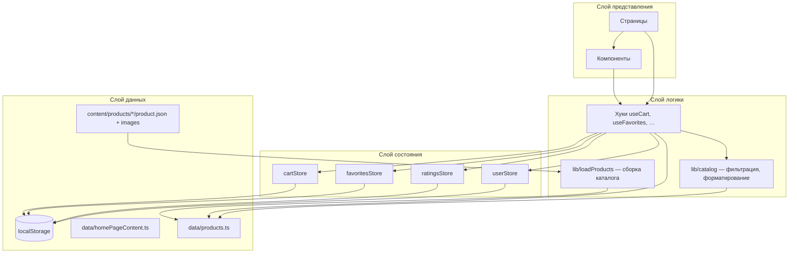
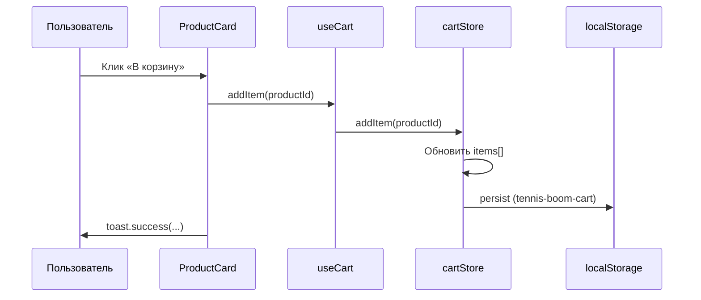
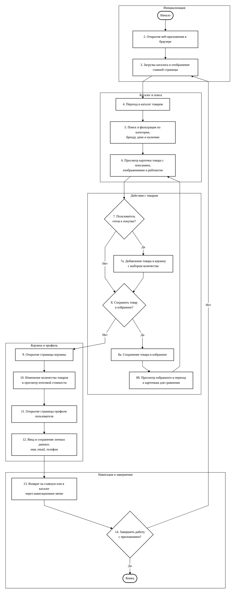
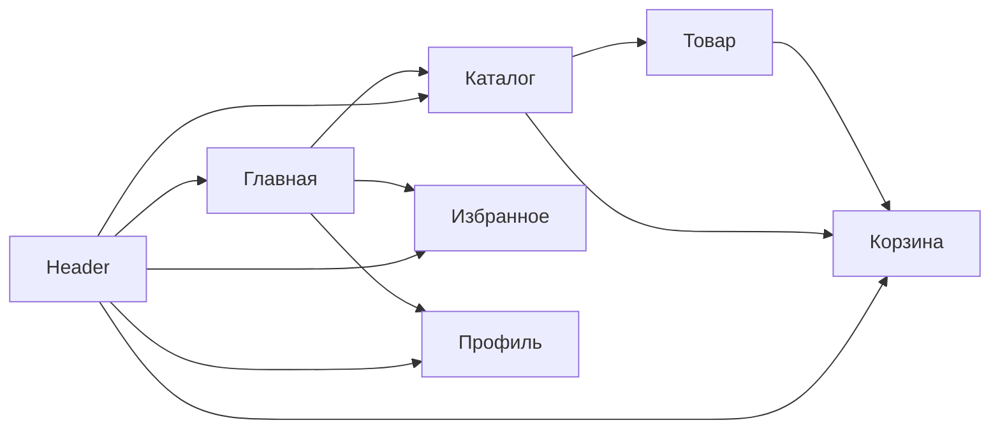

# Vibe Boom Tennis — документация проекта

> **Версия:** 0.0.0  
> **Тип:** одностраничное веб-приложение (SPA)  
> **Назначение:** демонстрационный интернет-магазин теннисной экипировки

---

## Содержание

1. [Обзор](#обзор)
2. [Технологический стек](#технологический-стек)
3. [Быстрый старт](#быстрый-старт)
4. [Структура проекта](#структура-проекта)
5. [Архитектура приложения](#архитектура-приложения)
6. [Маршрутизация](#маршрутизация)
7. [Управление состоянием](#управление-состоянием)
8. [Данные и каталог](#данные-и-каталог)
9. [Страницы приложения](#страницы-приложения)
10. [Компоненты](#компоненты)
11. [Хуки](#хуки)
12. [Типы данных](#типы-данных)
13. [Стилизация и UI](#стилизация-и-ui)
14. [Персистентность (localStorage)](#персистентность-localstorage)
15. [Сборка и качество кода](#сборка-и-качество-кода)
16. [Общий алгоритм работы (рисунок 2.1)](#общий-алгоритм-работы-рисунок-21)
17. [Алгоритм формирования корзины (план для блок-схемы)](#алгоритм-формирования-корзины-и-расчёта-итоговой-стоимости-план-для-блок-схемы)
18. [Глава 3 — текст для отчёта](#глава-3--программное-конструирование-текст-для-отчёта)
19. [Расширение проекта](#расширение-проекта)

---

## Обзор

**Vibe Boom Tennis** — клиентское React-приложение без бэкенда. Каталог товаров, корзина, избранное, пользовательские оценки и профиль работают полностью в браузере. Каталог собирается на этапе сборки из папок `src/content/products/`; пользовательские данные сохраняются в `localStorage` через Zustand persist.

### Ключевые возможности

| Функция | Описание |
|--------|----------|
| Каталог | 16 товаров с фильтрацией по поиску, категории, бренду, цене и наличию |
| Карточка товара | Галерея, описание, рейтинг, добавление в корзину и избранное |
| Корзина | Изменение количества, подсчёт итога, очистка |
| Избранное | Список товаров по ID с компактными карточками |
| Профиль | Форма с валидацией (имя, email, телефон) |
| Оценки | Пользователь может поставить 1–5 звёзд на странице товара |
| Уведомления | Toast-сообщения при действиях пользователя |

### Ограничения текущей версии

- Нет серверного API — заказ оформить нельзя, только просмотр корзины.
- Нет аутентификации — профиль локальный.
- Рейтинг товара в каталоге — статический; пользовательская оценка влияет только на странице детали.

---

## Технологический стек

| Категория | Технология | Назначение |
|-----------|------------|------------|
| Сборка | [Vite 6](https://vite.dev/) | Dev-сервер, HMR, production build |
| UI | [React 18](https://react.dev/) | Компонентный интерфейс |
| Язык | [TypeScript 5.8](https://www.typescriptlang.org/) | Статическая типизация |
| Маршруты | [React Router 6](https://reactrouter.com/) | Клиентская навигация |
| Состояние | [Zustand 5](https://zustand.docs.pmnd.rs/) | Глобальные сторы с persist |
| Стили | [Tailwind CSS 4](https://tailwindcss.com/) | Utility-first CSS |
| UI-кит | [shadcn/ui](https://ui.shadcn.com/) (Base UI + Radix) | Готовые доступные компоненты |
| Формы | [React Hook Form](https://react-hook-form.com/) + [Zod](https://zod.dev/) | Валидация профиля |
| Иконки | [Lucide React](https://lucide.dev/) | SVG-иконки |
| Уведомления | [Sonner](https://sonner.emilkowal.ski/) | Toast |

### Алиас путей

В `vite.config.ts` и `tsconfig.app.json` настроен алиас `@` → `src/`:

```ts
import { ROUTES } from '@/constants/routes'
import { useCart } from '@/hooks/useCart'
```

---

## Быстрый старт

### Требования

- Node.js 18+
- npm

### Установка и запуск

```bash
# Установка зависимостей
npm install

# Режим разработки (http://localhost:5173)
npm run dev

# Проверка типов и production-сборка
npm run build

# Просмотр production-сборки
npm run preview

# Линтинг
npm run lint
```

### Точка входа

1. `index.html` — корневой HTML, `lang="ru"`, favicon `/logo.png`.
2. `src/main.tsx` — монтирует `<App />` в `#root` внутри `StrictMode`.
3. `src/App.tsx` — `BrowserRouter` и дерево маршрутов.

---

## Структура проекта

```
tennis_boom/
├── public/
│   └── logo.png               # Логотип магазина (favicon + компонент Logo)
├── documents/
│   └── PROJECT_DOCUMENTATION.md
├── src/
│   ├── main.tsx
│   ├── App.tsx
│   ├── index.css
│   │
│   ├── content/               # Контент товаров (источник каталога)
│   │   └── products/
│   │       └── {slug}/
│   │           ├── product.json
│   │           └── *.jpg      # Изображения товара
│   │
│   ├── pages/                 # Страницы (feature-based)
│   │   ├── HomePage/
│   │   ├── ProductsPage/
│   │   ├── ProductDetailPage/
│   │   ├── CartPage/
│   │   ├── FavoritesPage/
│   │   ├── UserPage/
│   │   └── NotFoundPage/
│   │
│   ├── components/
│   │   ├── layout/            # AppLayout, Header, Footer, Logo, StoreName
│   │   ├── product/           # ProductCard, ProductFilter, CartItemRow, …
│   │   ├── icons/             # Иконки преимуществ на главной
│   │   └── ui/                # shadcn/ui примитивы
│   │
│   ├── hooks/                 # Обёртки над сторами и бизнес-логикой
│   ├── stores/                # Zustand-сторы
│   ├── data/                  # Агрегированные данные (products, homePageContent)
│   ├── constants/             # routes, branding, catalog, filters
│   ├── lib/                   # loadProducts, catalog, cn
│   └── types/                 # TypeScript-типы
│
├── components.json
├── vite.config.ts
└── package.json
```

### Соглашения по организации кода

- **Страницы** — `PageName/PageName.tsx` + `index.ts` с реэкспортом.
- **Сторы** — мутации состояния в `stores/`, вычисления и связка с UI — в `hooks/`.
- **Константы** — маршруты, брендинг, ключи `localStorage` в `constants/`.
- **Каталог** — контент в `content/products/`, сборка в `lib/loadProducts.ts`, публичный API — `data/products.ts`.
- **Утилиты** — `formatPrice`, `filterProducts` в `lib/catalog.ts`.

---

## Архитектура приложения

Приложение построено по слоистой схеме: представление → хуки → сторы → данные.



### Поток данных при добавлении в корзину



### Layout

`AppLayout` оборачивает все маршруты:

- **Header** — логотип, навигация, бейджи корзины и избранного.
- **`<main>`** — `<Outlet />` для контента страницы.
- **Footer** — подвал сайта.
- **Toaster** — глобальные уведомления Sonner.

---

## Маршрутизация

Маршруты определены в `src/constants/routes.ts`:

| Константа | Путь | Страница |
|-----------|------|----------|
| `ROUTES.HOME` | `/` | Главная |
| `ROUTES.PRODUCTS` | `/products` | Каталог |
| `ROUTES.PRODUCT_DETAIL` | `/products/:id` | Карточка товара |
| `ROUTES.CART` | `/cart` | Корзина |
| `ROUTES.FAVORITES` | `/favorites` | Избранное |
| `ROUTES.USER` | `/user` | Профиль |
| `ROUTES.NOT_FOUND` | `/404` | Страница ошибки |

```ts
getProductRoute('5') // → '/products/5'
```

Несуществующий товар на `ProductDetailPage` перенаправляется на `/404`. Любой неизвестный URL (`*`) также ведёт на `NotFoundPage`.

---

## Управление состоянием

Используется **Zustand** с middleware **persist** для сохранения в `localStorage`.

### cartStore (`src/stores/cartStore.ts`)

| Поле / метод | Тип | Описание |
|--------------|-----|----------|
| `items` | `CartItem[]` | `{ productId, quantity }` |
| `addItem(id, qty?)` | — | Добавить или увеличить количество |
| `removeItem(id)` | — | Удалить позицию |
| `updateQuantity(id, qty)` | — | Обновить qty; при `qty <= 0` — удалить |
| `clearCart()` | — | Очистить корзину |

### favoritesStore (`src/stores/favoritesStore.ts`)

| Поле / метод | Описание |
|--------------|----------|
| `productIds` | Массив ID избранных товаров |
| `toggleFavorite(id)` | Добавить / убрать |
| `isFavorite(id)` | Проверка наличия |
| `removeFavorite(id)` | Удалить из избранного |

### ratingsStore (`src/stores/ratingsStore.ts`)

| Поле / метод | Описание |
|--------------|----------|
| `ratings` | `Record<productId, ProductRating>` |
| `setRating(id, rating)` | Сохранить оценку 1–5 |
| `getRating(id)` | Получить оценку пользователя |

### userStore (`src/stores/userStore.ts`)

| Поле / метод | Описание |
|--------------|----------|
| `name`, `email`, `phone` | Профиль пользователя |
| `setProfile(profile)` | Сохранить данные |
| `resetProfile()` | Сброс к пустым значениям |

### Разделение store / hook

Сторы содержат минимальную логику мутаций. Хуки (`useCart`, `useFavorites`, …) добавляют вычисляемые значения, объединение с каталогом и стабильные колбэки для UI.

---

## Данные и каталог

### Источник данных: `src/content/products/`

Каждый товар — отдельная папка со slug-именем:

```
src/content/products/wilson-pro-staff-97/
├── product.json
├── 01.jpg
└── 02.jpg
```

Пример `product.json`:

```json
{
  "id": "1",
  "slug": "wilson-pro-staff-97",
  "name": "Wilson Pro Staff 97 ракетка",
  "description": "…",
  "price": 24990,
  "category": "Ракетки",
  "brand": "Wilson",
  "rating": 4.8,
  "inStock": true
}
```

Опционально в `product.json` можно указать поле `images` — массив имён файлов для явного порядка галереи. Если поле отсутствует, изображения сортируются по имени файла.

### Сборка каталога (`src/lib/loadProducts.ts`)

Функция `loadProducts()` использует Vite `import.meta.glob`:

- `../content/products/*/product.json` — метаданные (eager).
- `../content/products/*/*.{jpg,jpeg,png,webp}` — изображения с `?url`.

Товары сортируются по числовому `id`. При отсутствии изображений или несовпадении имён файлов выбрасывается ошибка на этапе сборки.

### Публичный API (`src/data/products.ts`)

```ts
export const products = loadProducts()
export const catalogMinPrice = Math.min(...)
export const catalogMaxPrice = Math.max(...)
```

В каталоге **16 позиций** в категориях: Ракетки, Мячи, Одежда, Обувь, Аксессуары. Бренды: Wilson, Head, Babolat, Nike, Adidas, Yonex, Asics.

### Контент главной (`src/data/homePageContent.ts`)

- `homeFeatures` — 6 блоков «Почему выбирают нас».
- `featuredProducts` — топ-4 товара по рейтингу.

### Фильтрация (`src/lib/catalog.ts`)

`filterProducts(productList, filters)` применяет условия (логическое И):

1. Поиск по `name`, `category`, `brand`.
2. Фильтр категории и бренда.
3. Диапазон цены.
4. Только в наличии (`inStockOnly`).

Категории и бренды в фильтрах формируются динамически через `getUniqueFieldValues` из актуального каталога.

Начальные фильтры: `src/constants/filters.ts` → `defaultProductFilters`.

### Брендинг (`src/constants/branding.ts`)

- `STORE_NAME`, `STORE_SLOGAN`, `CTA_SLOGAN`, `PROFILE_HEADER_SLOGAN`
- `STORE_NAME_PARTS`, `CTA_SLOGAN_PARTS` — части текста с neon CSS-классами

---

## Страницы приложения

### HomePage (`/`)

1. **Hero-секция** — логотип, слоган, CTA в каталог и избранное.
2. **Хиты каталога** — 4 карточки `ProductCard`.
3. **Преимущества** — 6 карточек с иконками.
4. **Нижний CTA** — ссылки на каталог и профиль.

### ProductsPage (`/products`)

- Панель `ProductFilter` + сетка `ProductCard`.
- `useProductFilters` имитирует загрузку 300 мс (`isLoading`).

### ProductDetailPage (`/products/:id`)

- Галерея, описание, рейтинг, пользовательская оценка.
- Добавление в корзину и избранное.

### CartPage, FavoritesPage, UserPage, NotFoundPage

См. исходники в `src/pages/` — поведение без изменений относительно предыдущей версии.

---

## Компоненты

### Layout (`src/components/layout/`)

| Компонент | Назначение |
|-----------|------------|
| `AppLayout` | Header + Outlet + Footer + Toaster |
| `Header` | Навигация, счётчики корзины/избранного |
| `Footer` | Подвал |
| `Logo` | Логотип `/logo.png` |
| `StoreName` | Стилизованное название магазина |

### Product (`src/components/product/`)

| Компонент | Назначение |
|-----------|------------|
| `ProductCard` | Карточка (default / compact) |
| `ProductFilter` | Фильтры каталога |
| `ProductGallery` | Галерея на странице товара |
| `CartItemRow` | Строка в корзине |
| `RatingStars` | Звёзды рейтинга |
| `QuantityControl` | Счётчик количества |
| `EmptyState` | Пустое состояние |

### UI (`src/components/ui/`)

Используемые примитивы shadcn/ui:

`Button`, `Card`, `Input`, `Form`, `Select`, `Slider`, `Checkbox`, `Badge`, `Breadcrumb`, `Separator`, `Skeleton`, `Label`, `Sonner`.

---

## Хуки

| Хук | Файл | Описание |
|-----|------|----------|
| `useProducts` | `hooks/useProducts.ts` | Массив `products` |
| `useProductFilters` | `hooks/useProductFilters.ts` | Фильтры + `filteredProducts` + `isLoading` |
| `useCart` | `hooks/useCart.ts` | Корзина с итогами |
| `useFavorites` | `hooks/useFavorites.ts` | Избранное |
| `useRatings` | `hooks/useRatings.ts` | Пользовательские оценки |

---

## Типы данных

Центральный реэкспорт: `src/types/index.ts`.

```ts
type CartItem = { productId: string; quantity: number }

type Product = {
  id: string
  name: string
  description: string
  price: number
  category: string
  brand: string
  images: string[]
  rating: number
  inStock: boolean
}

type ProductFilters = {
  search: string
  category: string
  brand: string
  minPrice: number
  maxPrice: number
  inStockOnly: boolean
}

type UserProfile = { name: string; email: string; phone: string }
type ProductRating = 1 | 2 | 3 | 4 | 5
```

---

## Стилизация и UI

### Tailwind CSS 4

`@import "tailwindcss"` в `src/index.css`, плагин `@tailwindcss/vite`.

### Тема «neon green»

CSS-переменные `--neon-green-light`, `--neon-green-mid`, `--neon-green-deep` и утилиты `neon-border`, `neon-glow`, `neon-text-green-*`.

### Доступность

`aria-label`, `sr-only`, семантические теги, `focus-visible:ring`.

---

## Персистентность (localStorage)

Ключи в `src/constants/catalog.ts`:

| Ключ | Стор | Поля |
|------|------|------|
| `tennis-boom-cart` | cartStore | `items` |
| `tennis-boom-favorites` | favoritesStore | `productIds` |
| `tennis-boom-ratings` | ratingsStore | `ratings` |
| `tennis-boom-user` | userStore | `name`, `email`, `phone` |

---

## Сборка и качество кода

```json
{
  "dev": "vite",
  "build": "tsc -b && vite build",
  "lint": "eslint .",
  "preview": "vite preview"
}
```

TypeScript: `noUnusedLocals`, `noUnusedParameters`, `verbatimModuleSyntax`.

---

## Общий алгоритм работы (рисунок 2.1)

Общий алгоритм работы веб-приложения **«Vibe Boom Tennis»** состоит из следующей последовательности действий:

- открытие веб-приложения в браузере;
- загрузка каталога товаров и отображение главной страницы;
- переход в каталог товаров;
- поиск и фильтрация товаров по категории, бренду, цене и наличию;
- просмотр карточки товара с описанием, изображениями и рейтингом из каталога;
- добавление товара в корзину с выбором количества (если пользователь готов к покупке);
- сохранение понравившегося товара в избранное (если пользователь хочет вернуться к нему позже);
- просмотр списка избранных товаров и повторный переход к карточкам для сравнения;
- открытие страницы корзины;
- изменение количества товаров в корзине и просмотр итоговой стоимости;
- открытие страницы профиля пользователя;
- ввод и сохранение личных данных (имя, email, телефон);
- возврат на главную страницу или в каталог через навигационное меню;
- завершение работы с приложением.

**Оформление блок-схемы** соответствует ГОСТ 19.701-90 и синтаксису Mermaid Flowchart:

| Элемент | Форма в Mermaid | Назначение |
|---------|-----------------|------------|
| Терминатор | `([...])` stadium | Начало / конец |
| Процесс | `[...]` | Действие пользователя или экран |
| Решение | `{...}` diamond | Условие с ветвями «Да» / «Нет» |
| Группа | `subgraph` | Логический этап алгоритма |

Стили задаются через `classDef` (белая заливка, чёрный контур), рёбра — прямые (`curve: linear`).

*Рисунок 2.1 – Общий алгоритм работы веб-приложения «Vibe Boom Tennis»*



### Пояснение к схеме

| Этап | Шаги | Содержание |
|------|------|------------|
| Инициализация | 1–3 | Запуск приложения, загрузка каталога, главная страница |
| Каталог и поиск | 4–6 | Переход в каталог, фильтрация, просмотр карточки товара |
| Действия с товаром | 7–8 | Ветвление: покупка → корзина; избранное → сравнение → снова карточка |
| Корзина и профиль | 9–12 | Корзина, итоговая сумма, профиль, сохранение данных |
| Навигация и завершение | 13–14 | Возврат через меню; при отказе — цикл на главную, при согласии — конец |

### Условные обозначения

| Фигура | Обозначение Mermaid | Значение |
|--------|---------------------|----------|
| Стадион (овал) | `([текст])` | Начало / конец алгоритма |
| Прямоугольник | `[текст]` | Процесс (действие или экран) |
| Ромб | `{текст}` | Условие с ответами «Да» / «Нет» |
| Пунктирная рамка | `subgraph` | Группировка шагов одного этапа |
| Стрелка | `-->` | Направление перехода |

---

## Алгоритм формирования корзины и расчёта итоговой стоимости (план для блок-схемы)

Алгоритм формирования корзины и расчёта итоговой стоимости выполняется на странице корзины веб-приложения **«Vibe Boom Tennis»** после перехода пользователя в раздел «Корзина» из каталога, карточки товара или навигационного меню. Алгоритм начинается с момента открытия страницы корзины пользователем.

Сначала программа загружает список позиций корзины из локального хранилища браузера. Затем для каждой сохранённой позиции выполняется поиск соответствующего товара в каталоге по идентификатору, после чего формируется полный список товаров с указанием наименования, цены за единицу и количества. Далее программа проверяет, содержит ли корзина хотя бы один товар. Если корзина пуста, на экран выводится сообщение о том, что товары не добавлены, и отображается предложение перейти в каталог; в этом случае расчёт итоговой стоимости не выполняется, и программа ожидает дальнейших действий пользователя до завершения работы с корзиной.

Если в корзине есть товары, программа отображает их список на странице корзины. После этого для каждой позиции рассчитывается стоимость строки как произведение цены товара на его количество, и полученное значение выводится в интерфейсе рядом с соответствующей позицией. Затем программа вычисляет общее количество товаров в корзине как сумму количеств всех позиций и рассчитывает итоговую стоимость заказа как сумму стоимостей отдельных позиций. Рассчитанная итоговая сумма отображается в нижней части страницы корзины, а счётчик товаров в навигационной панели приложения обновляется.

Далее программа переходит в режим ожидания действий пользователя и проверяет, было ли изменение состава корзины. Если пользователь не выполнял никаких действий, программа снова проверяет, продолжает ли пользователь работу с корзиной. Если пользователь решает покинуть страницу корзины или перейти в другой раздел приложения, алгоритм завершает свою работу.

Если пользователь изменил состав корзины, программа определяет вид выполненного действия. При изменении количества товара программа проверяет, больше ли новое количество нуля. Если новое количество больше нуля, соответствующая позиция обновляется новым значением количества. Если новое количество равно нулю, позиция удаляется из корзины. Если пользователь нажимает кнопку удаления отдельной позиции, выбранный товар исключается из корзины. Если пользователь нажимает кнопку полной очистки корзины, из списка удаляются все позиции.

После любого изменения состава корзины программа сохраняет обновлённый список позиций в локальном хранилище браузера. Затем повторно проверяется, остались ли в корзине товары. Если корзина стала пустой, программа отображает сообщение о пустой корзине и предлагает перейти в каталог. Если товары в корзине остались, программа заново рассчитывает стоимость каждой позиции, общее количество товаров и итоговую сумму заказа, после чего обновляет отображаемые на экране значения.

После пересчёта программа снова проверяет, продолжает ли пользователь работу с корзиной. Если пользователь изменяет количество, удаляет позиции или очищает корзину, выполнение возвращается к проверке изменения состава корзины. Если пользователь завершает работу с корзиной и переходит в другой раздел приложения, алгоритм завершает свою работу.

---

## Глава 3 — Программное конструирование (текст для отчёта)

### 3.2 Описание программной реализации

Программа реализована на основе функциональной парадигмы программирования.

Функция **«App»** является основной функцией приложения. В ней настраивается маршрутизация между страницами и выполняется отрисовка содержимого в зависимости от адреса страницы, на которой находится пользователь.

Общий макет интерфейса (шапка с навигационным меню и область содержимого) реализован в **«AppLayout»** и подключается из **«App»**. Все реализованные функции представлены в таблице 3.1, реализация функций представлена в приложении А.

**Таблица 3.1 – Функции**

| Функция | Входные параметры | Описание | Возвращаемое значение |
|---------|-------------------|----------|------------------------|
| App | — | Настройка маршрутизации и отображение страниц в зависимости от адреса URL | JSX-разметка приложения |
| AppLayout | — | Вывод шапки сайта с навигационным меню и области содержимого страницы | JSX-разметка макета |
| loadProducts | — | Загрузка каталога товаров из файлов `product.json` и изображений | Массив товаров `Product[]` |
| filterProducts | `productList`, `filters` | Фильтрация товаров по поиску, категории, бренду, цене и наличию | Массив отфильтрованных товаров |
| useCart | — | Получение состава корзины, итоговой суммы, добавление и изменение позиций | Объект с данными и методами корзины |
| useFavorites | — | Проверка товара в избранном, добавление и удаление из списка | Объект с `productIds`, `toggleFavorite` |
| useProductFilters | — | Управление параметрами фильтрации и получение отфильтрованного каталога | Объект с `filters`, `filteredProducts` |
| useUserStore.setProfile | `UserProfile` | Сохранение имени, email и телефона пользователя в `localStorage` | — |
| getProductRoute | `id` | Формирование пути для перехода на страницу товара | Строка с адресом страницы |

---

## Расширение проекта

### Добавление товара

1. Создать папку `src/content/products/{slug}/`.
2. Добавить `product.json` с уникальным `id`.
3. Положить изображения `.jpg` / `.png` / `.webp` в ту же папку.
4. Перезапустить dev-сервер или выполнить `npm run build`.

Категории и бренды в фильтрах обновятся автоматически.

### Подключение API

Заменить `loadProducts()` на асинхронную загрузку в `useProducts` (React Query / fetch).

### Добавление страницы

1. `src/pages/NewPage/NewPage.tsx` + `index.ts`.
2. Константа в `ROUTES`.
3. `<Route>` в `App.tsx`.

---

## Диаграмма навигации



---

*Документация для репозитория `vibe-boom-tennis`. Обновлена после рефакторинга: контентный каталог, удаление неиспользуемых файлов.*
