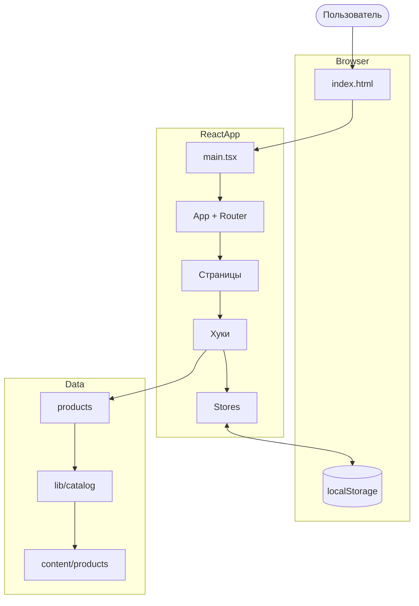
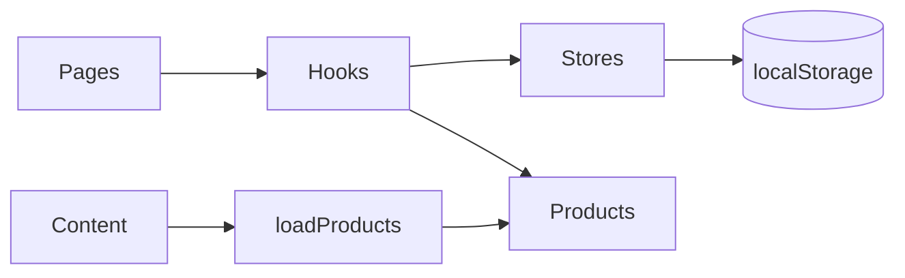

# Vibe Boom Tennis — документация проекта

> **Версия:** 0.0.0  
> **Тип:** одностраничное веб-приложение (SPA)  
> **Назначение:** демонстрационный интернет-магазин теннисной экипировки

---

## Содержание

1. [Обзор](#обзор)
2. [Полное объяснение программы для новичков](#полное-объяснение-программы-для-новичков)
3. [Технологический стек](#технологический-стек)
4. [Быстрый старт](#быстрый-старт)
5. [Структура проекта](#структура-проекта)
6. [Архитектура](#архитектура)
7. [Маршрутизация](#маршрутизация)
8. [Управление состоянием](#управление-состоянием)
9. [Данные и каталог](#данные-и-каталог)
10. [Страницы и компоненты](#страницы-и-компоненты)
11. [Персистентность](#персистентность-localstorage)
12. [Расширение проекта](#расширение-проекта)

---

## Обзор

**Vibe Boom Tennis** — клиентское React-приложение без бэкенда. Каталог товаров, корзина, избранное, пользовательские оценки и профиль работают полностью в браузере. Каталог собирается на этапе сборки из папок `src/content/products/`; пользовательские данные сохраняются в `localStorage` через Zustand persist.

### Ключевые возможности

| Функция | Описание |
|--------|----------|
| Каталог | 16 товаров с фильтрацией по поиску, категории, бренду, цене и наличию |
| Карточка товара | Галерея, описание, рейтинг, добавление в корзину и избранное |
| Корзина | Изменение количества, подсчёт итога, очистка |
| Избранное | Список товаров по ID |
| Профиль | Форма с валидацией (имя, email, телефон) |
| Оценки | Пользователь может поставить 1–5 звёзд на странице товара |
| Тема | Светлая / тёмная тема с сохранением выбора |

### Ограничения

- Нет серверного API — заказ оформить нельзя.
- Нет аутентификации — профиль локальный, привязан к браузеру.
- Рейтинг на карточке в каталоге — из `product.json`; пользовательская оценка влияет на странице товара.

---

## Полное объяснение программы для новичков

Этот раздел написан для тех, кто только начинает изучать веб-разработку и React. Здесь объясняется **вся программа целиком**: что она делает, из каких частей состоит, как данные проходят через приложение и с чего начать чтение кода.

### 1. Что это за программа простыми словами

**Vibe Boom Tennis** — это сайт-магазин теннисных товаров, который работает **полностью в браузере**. Есть главная страница, каталог, карточки товаров, корзина, избранное и профиль пользователя. В отличие от крупных магазинов, у нас **нет сервера с базой данных** — все товары «зашиты» в программу, а корзина, избранное и профиль сохраняются в памяти браузера (`localStorage`).

Когда пользователь открывает сайт:

1. Браузер загружает HTML-страницу и JavaScript-файлы.
2. React «оживляет» страницу — рисует кнопки, карточки, меню.
3. Пользователь кликает по ссылкам — React **не перезагружает** всю страницу, а меняет только нужную часть экрана.
4. При добавлении в корзину данные записываются в `localStorage` — после перезагрузки браузера корзина не пропадёт.

### 2. Базовые понятия

| Термин | Простое объяснение | Где в проекте |
|--------|-------------------|---------------|
| **HTML** | Каркас страницы | `index.html` — контейнер `<div id="root">` |
| **CSS** | Внешний вид | `src/index.css`, классы Tailwind |
| **TypeScript** | JavaScript с проверкой типов | Все файлы `.ts` и `.tsx` |
| **React** | Библиотека для UI из компонентов | `src/components/`, `src/pages/` |
| **Компонент** | Переиспользуемая часть интерфейса | `ProductCard`, `Header` |
| **Страница (Page)** | Экран по адресу в браузере | `HomePage`, `CartPage` |
| **SPA** | Одна HTML-страница, контент меняется без перезагрузки | Всё приложение |
| **Маршрут (Route)** | Адрес, например `/products` | `constants/routes.ts`, `App.tsx` |
| **Состояние (State)** | Изменяемые данные | Zustand в `src/stores/` |
| **Хук (Hook)** | Функция для доступа к логике React | `useCart`, `useProductFilters` |
| **Props** | Параметры компонента | `product` в `ProductCard` |
| **localStorage** | Хранилище браузера | Ключи `tennis-boom-cart` и др. |

### 3. Что происходит при запуске (пошагово)

```
Пользователь → index.html → main.tsx → App.tsx → AppLayout → Страница
```

**Шаг 1. `index.html`** — браузер получает HTML с пустым `<div id="root">`.

**Шаг 2. `src/main.tsx`** — точка входа:

1. Подключает стили `index.css`.
2. Вызывает `initializeTheme()` — тема из `localStorage`.
3. Монтирует `<App />` в `#root`.

**Шаг 3. `src/App.tsx`** — React Router сопоставляет URL и страницу:

| Адрес | Страница |
|-------|----------|
| `/` | `HomePage` |
| `/products` | `ProductsPage` |
| `/products/:id` | `ProductDetailPage` |
| `/cart` | `CartPage` |
| `/favorites` | `FavoritesPage` |
| `/user` | `UserPage` |
| другой | `NotFoundPage` |

**Шаг 4. `AppLayout`** — шапка + `<Outlet />` (контент страницы) + подвал + уведомления.

**Шаг 5. Каталог** — при импорте `data/products.ts` вызывается `loadProducts()`: читает `content/products/*/product.json` и изображения, собирает 16 товаров.

### 4. Карта проекта

| Папка | Назначение | Примеры |
|-------|------------|---------|
| `src/pages/` | Экраны для пользователя | `CartPage`, `ProductsPage` |
| `src/components/` | Блоки интерфейса | `ProductCard`, `Header` |
| `src/hooks/` | Логика для страниц | `useCart`, `useFavorites` |
| `src/stores/` | Глобальные данные | `cartStore`, `userStore` |
| `src/content/` | Исходники товаров | `product.json`, фото |
| `src/data/` | Готовые данные | `products.ts` |
| `src/lib/` | Утилиты | `catalog.ts`, `loadProducts.ts` |
| `src/constants/` | Константы | маршруты, ключи storage |
| `src/types/` | TypeScript-типы | `Product`, `CartItem` |

**С чего начать чтение:** `main.tsx` → `App.tsx` → любая `Page` → её `components` и `hooks`.

### 5. Каждая страница подробно

#### Главная (`HomePage`, `/`)

- Hero с логотипом и слоганом.
- 4 хита каталога (`featuredProducts`).
- 6 блоков преимуществ.
- CTA-кнопки в каталог и профиль.

Данные: `data/homePageContent.ts`, товары из `products`.

#### Каталог (`ProductsPage`, `/products`)

Слева — `ProductFilter`, справа — сетка `ProductCard`.

**Фильтрация:**

1. `useProductFilters` хранит `filters` в `useState`.
2. При изменении вызывается `filterProducts` из `lib/catalog.ts`.
3. Для каждого товара **последовательно** проверяется:
   - поиск в `name + category + brand`;
   - категория;
   - бренд;
   - диапазон цены;
   - наличие (`inStockOnly`).
4. Не прошёл проверку — исключается.
5. Пустой результат → `EmptyState` + сброс фильтров.
6. Первые 300 мс — skeleton-заглушки (`isLoading`).

#### Страница товара (`ProductDetailPage`, `/products/:id`)

1. `useParams` берёт `id` из URL.
2. `getProductById` ищет товар; нет — редирект на `/404`.
3. Галерея, описание, рейтинг каталога, **ваша оценка** (1–5 → `ratingsStore`).
4. Количество + «В корзину» + «В избранное».

#### Корзина (`CartPage`, `/cart`)

В store только `{ productId, quantity }`. Цена и название — из каталога при отображении.

1. `getCartProducts()` — связка позиций с товарами.
2. Пусто → заглушка.
3. `totalPrice = Σ (price × quantity)`.
4. Изменение qty → `updateQuantity`; при `qty ≤ 0` — удаление.
5. Бейдж в шапке: `totalItems` = сумма всех `quantity`.

#### Избранное (`FavoritesPage`, `/favorites`)

Массив `productIds` в `favoritesStore`. Товары отбираются из `products` по ID. Карточки в режиме `compact`.

#### Профиль (`UserPage`, `/user`)

React Hook Form + Zod:

| Поле | Правило |
|------|---------|
| Имя | ≥ 2 символа |
| Email | валидный email |
| Телефон | российский формат |

Submit → `userStore.setProfile` → `localStorage` → toast.

#### 404 (`NotFoundPage`)

Неизвестный URL или несуществующий товар.

### 6. Компоненты

**Layout:** `Header`, `Footer`, `Logo`, `StoreName`, `ThemeToggle`, `AppLayout`.

**Product:** `ProductCard`, `ProductFilter`, `ProductGallery`, `CartItemRow`, `RatingStars`, `QuantityControl`, `EmptyState`.

**UI (shadcn):** `Button`, `Input`, `Card`, `Form`, `Select`, `Slider`, `Checkbox`, `Badge`, `Breadcrumb`, `Skeleton`, `Sonner`.

### 7. Сторы и хуки

| Store | Данные | localStorage |
|-------|--------|--------------|
| `cartStore` | `items[]` | `tennis-boom-cart` |
| `favoritesStore` | `productIds[]` | `tennis-boom-favorites` |
| `ratingsStore` | `Record<id, 1-5>` | `tennis-boom-ratings` |
| `userStore` | name, email, phone | `tennis-boom-user` |
| `themeStore` | light / dark | `tennis-boom-theme` |

**Persist** сохраняет данные при изменении и восстанавливает при загрузке. `partialize` — только данные, без методов.

| Хук | Дополнительно |
|-----|---------------|
| `useCart` | `totalPrice`, `totalItems`, `getCartProducts` |
| `useFavorites` | `favoritesCount`, `toggleFavorite` |
| `useProductFilters` | `filters`, `filteredProducts`, `isLoading` |
| `useProducts` | массив `products` |
| `useRatings` | оценки пользователя |
| `useTheme` | переключение темы |

**Цепочка «В корзину»:**

```
Клик → useCart().addItem(id) → cartStore → localStorage → обновление бейджа в Header
```

### 8. Каталог товаров

```
content/products/wilson-pro-staff-97/
├── product.json
├── 01.jpg
└── 02.jpg
```

`loadProducts()` через `import.meta.glob` собирает массив при сборке. `data/products.ts` экспортирует `products`, `catalogMinPrice`, `catalogMaxPrice`.

### 9. TypeScript

Типы в `src/types/` описывают форму данных. Компилятор ловит опечатки (`product.prce` → ошибка) до запуска.

### 10. Стили

**Tailwind** — классы в JSX: `className="flex gap-2 text-primary"`.  
**Тема neon** — CSS-переменные в `index.css`.  
**Адаптив** — `sm:`, `lg:` префиксы для разных экранов.

### 11. Toast-уведомления

`toast.success('...')` через Sonner. `<Toaster />` в `AppLayout`.

### 12. Полный сценарий пользователя

1. Открывает сайт → главная.
2. «В каталог» → фильтр «Wilson».
3. Клик на карточку → страница товара.
4. Количество 2 → «В корзину».
5. Меню → корзина → видит итог 49 980 ₽.
6. Профиль → сохраняет имя и email.
7. Закрывает вкладку → при возврате данные на месте.

### 13. Чего программа не делает

- Нет оплаты и оформления заказа.
- Нет пароля и синхронизации между устройствами.
- Очистка данных браузера удалит корзину и профиль.

### 14. Маршрут изучения кода

```
1. index.html
2. src/main.tsx
3. src/App.tsx
4. src/constants/routes.ts
5. src/components/layout/AppLayout.tsx
6. src/pages/HomePage/HomePage.tsx
7. src/pages/ProductsPage/ProductsPage.tsx
8. src/hooks/useProductFilters.ts
9. src/lib/catalog.ts
10. src/components/product/ProductCard.tsx
11. src/stores/cartStore.ts
12. src/hooks/useCart.ts
13. src/pages/CartPage/CartPage.tsx
14. src/pages/UserPage/UserPage.tsx
```

### 15. Глоссарий файлов

| Файл | Назначение |
|------|------------|
| `vite.config.ts` | Сборщик, алиас `@` |
| `package.json` | Зависимости и скрипты |
| `src/index.css` | Глобальные стили и тема |
| `src/lib/utils.ts` | `cn()` — склейка CSS-классов |
| `src/lib/theme.ts` | Инициализация темы |
| `src/constants/filters.ts` | Фильтры по умолчанию |
| `src/constants/branding.ts` | Название и слоганы |

### 16. Частые вопросы

**Почему SPA, а не отдельные HTML-страницы?** Быстрее навигация, плавный UX.

**Почему корзина не хранит цену?** Цена всегда из актуального каталога.

**Что такое `@/`?** Сокращение для `src/`.

**Как добавить товар?** Папка в `content/products/` + `product.json` + фото.

### 17. Итоговая схема



**Вывод:** товары из файлов при сборке, пользовательские данные в Zustand + localStorage. Страницы = экраны, компоненты = UI, хуки = связка, сторы = изменяемые данные.

---

## Технологический стек

| Категория | Технология |
|-----------|------------|
| Сборка | Vite 6 |
| UI | React 18 |
| Язык | TypeScript 5.8 |
| Маршруты | React Router 6 |
| Состояние | Zustand 5 + persist |
| Стили | Tailwind CSS 4 |
| UI-кит | shadcn/ui |
| Формы | React Hook Form + Zod |
| Иконки | Lucide React |
| Уведомления | Sonner |

Алиас `@` → `src/` в `vite.config.ts` и `tsconfig.app.json`.

---

## Быстрый старт

```bash
npm install
npm run dev      # http://localhost:5173
npm run build
npm run preview
npm run lint
```

Точка входа: `index.html` → `main.tsx` → `App.tsx`.

---

## Структура проекта

```
src/
├── content/products/{slug}/   # product.json + images
├── pages/                     # HomePage, ProductsPage, …
├── components/layout|product|ui/
├── hooks/
├── stores/
├── data/
├── constants/
├── lib/
└── types/
```

---

## Архитектура

Слои: **Страницы/компоненты** → **Хуки** → **Сторы** → **Данные/localStorage**.



---

## Маршрутизация

См. `src/constants/routes.ts`. `getProductRoute(id)` → `/products/{id}`.

---

## Управление состоянием

### cartStore

- `items: { productId, quantity }[]`
- `addItem`, `removeItem`, `updateQuantity`, `clearCart`

### favoritesStore

- `productIds[]`, `toggleFavorite`, `isFavorite`

### ratingsStore

- `ratings: Record<id, 1|2|3|4|5>`

### userStore

- `name`, `email`, `phone`, `setProfile`

---

## Данные и каталог

`loadProducts()` — `import.meta.glob` по `content/products/`.  
`filterProducts()` — поиск, категория, бренд, цена, наличие (логическое И).

---

## Страницы и компоненты

| Страница | Путь | Ключевые компоненты |
|----------|------|---------------------|
| Главная | `/` | Hero, featured cards |
| Каталог | `/products` | ProductFilter, ProductCard |
| Товар | `/products/:id` | ProductGallery, RatingStars |
| Корзина | `/cart` | CartItemRow, EmptyState |
| Избранное | `/favorites` | ProductCard compact |
| Профиль | `/user` | Form + Zod |
| 404 | `*` | NotFoundPage |

---

## Персистентность (localStorage)

| Ключ | Store |
|------|-------|
| `tennis-boom-cart` | cartStore |
| `tennis-boom-favorites` | favoritesStore |
| `tennis-boom-ratings` | ratingsStore |
| `tennis-boom-user` | userStore |
| `tennis-boom-theme` | themeStore |

---

## Расширение проекта

### Новый товар

1. `src/content/products/{slug}/product.json` с уникальным `id`.
2. Изображения в ту же папку.
3. `npm run dev` или `npm run build`.

### Новая страница

1. `src/pages/NewPage/`
2. Константа в `ROUTES`
3. `<Route>` в `App.tsx`

---

*Документация проекта Vibe Boom Tennis. Раздел для новичков — полное руководство по пониманию кода.*
