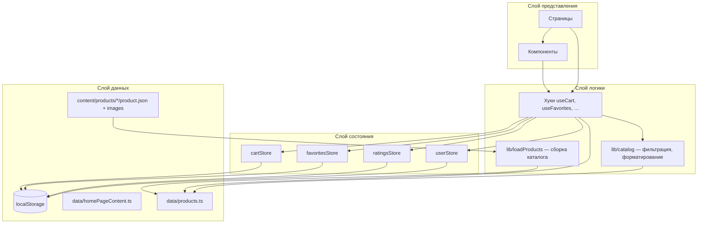
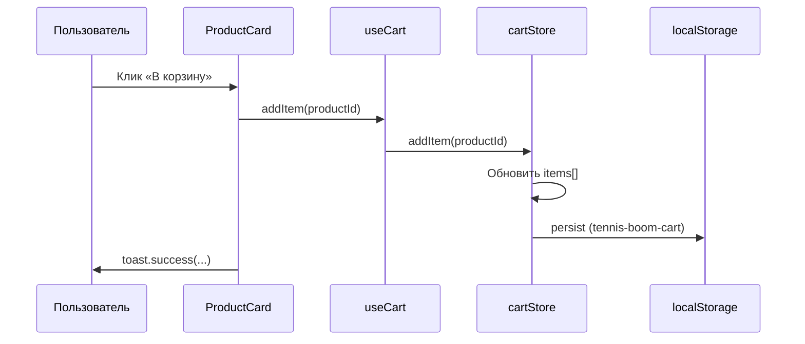
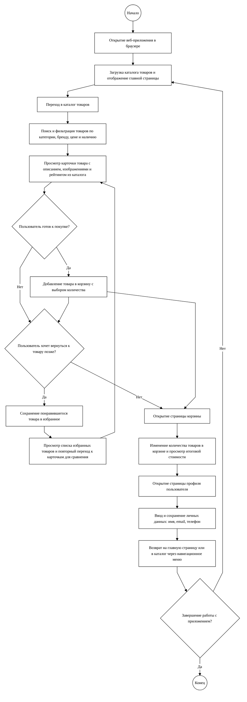
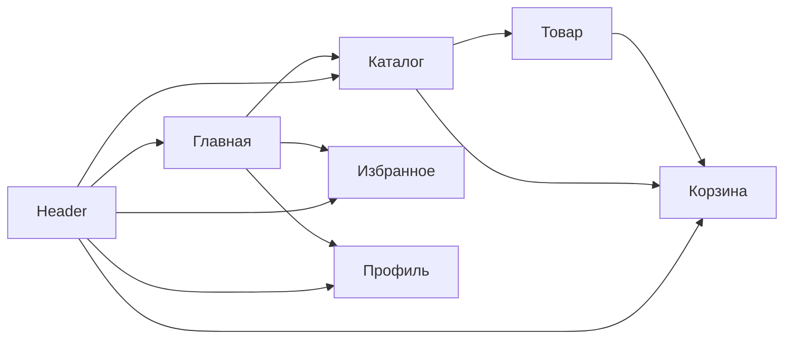

# Vibe Boom Tennis — документация проекта

> **Версия:** 0.0.0  
> **Тип:** одностраничное веб-приложение (SPA)  
> **Назначение:** демонстрационный интернет-магазин теннисной экипировки

---

## Содержание

1. [Обзор](#обзор)
2. [Технологический стек](#технологический-стек)
3. [Быстрый старт](#быстрый-старт)
4. [Структура проекта](#структура-проекта)
5. [Архитектура приложения](#архитектура-приложения)
6. [Маршрутизация](#маршрутизация)
7. [Управление состоянием](#управление-состоянием)
8. [Данные и каталог](#данные-и-каталог)
9. [Страницы приложения](#страницы-приложения)
10. [Компоненты](#компоненты)
11. [Хуки](#хуки)
12. [Типы данных](#типы-данных)
13. [Стилизация и UI](#стилизация-и-ui)
14. [Персистентность (localStorage)](#персистентность-localstorage)
15. [Сборка и качество кода](#сборка-и-качество-кода)
16. [Общий алгоритм работы (рисунок 2.1)](#общий-алгоритм-работы-рисунок-21)
17. [Расширение проекта](#расширение-проекта)

---

## Обзор

**Vibe Boom Tennis** — клиентское React-приложение без бэкенда. Каталог товаров, корзина, избранное, пользовательские оценки и профиль работают полностью в браузере. Каталог собирается на этапе сборки из папок `src/content/products/`; пользовательские данные сохраняются в `localStorage` через Zustand persist.

### Ключевые возможности

| Функция | Описание |
|--------|----------|
| Каталог | 16 товаров с фильтрацией по поиску, категории, бренду, цене и наличию |
| Карточка товара | Галерея, описание, рейтинг, добавление в корзину и избранное |
| Корзина | Изменение количества, подсчёт итога, очистка |
| Избранное | Список товаров по ID с компактными карточками |
| Профиль | Форма с валидацией (имя, email, телефон) |
| Оценки | Пользователь может поставить 1–5 звёзд на странице товара |
| Уведомления | Toast-сообщения при действиях пользователя |

### Ограничения текущей версии

- Нет серверного API — заказ оформить нельзя, только просмотр корзины.
- Нет аутентификации — профиль локальный.
- Рейтинг товара в каталоге — статический; пользовательская оценка влияет только на странице детали.

---

## Технологический стек

| Категория | Технология | Назначение |
|-----------|------------|------------|
| Сборка | [Vite 6](https://vite.dev/) | Dev-сервер, HMR, production build |
| UI | [React 18](https://react.dev/) | Компонентный интерфейс |
| Язык | [TypeScript 5.8](https://www.typescriptlang.org/) | Статическая типизация |
| Маршруты | [React Router 6](https://reactrouter.com/) | Клиентская навигация |
| Состояние | [Zustand 5](https://zustand.docs.pmnd.rs/) | Глобальные сторы с persist |
| Стили | [Tailwind CSS 4](https://tailwindcss.com/) | Utility-first CSS |
| UI-кит | [shadcn/ui](https://ui.shadcn.com/) (Base UI + Radix) | Готовые доступные компоненты |
| Формы | [React Hook Form](https://react-hook-form.com/) + [Zod](https://zod.dev/) | Валидация профиля |
| Иконки | [Lucide React](https://lucide.dev/) | SVG-иконки |
| Уведомления | [Sonner](https://sonner.emilkowal.ski/) | Toast |

### Алиас путей

В `vite.config.ts` и `tsconfig.app.json` настроен алиас `@` → `src/`:

```ts
import { ROUTES } from '@/constants/routes'
import { useCart } from '@/hooks/useCart'
```

---

## Быстрый старт

### Требования

- Node.js 18+
- npm

### Установка и запуск

```bash
# Установка зависимостей
npm install

# Режим разработки (http://localhost:5173)
npm run dev

# Проверка типов и production-сборка
npm run build

# Просмотр production-сборки
npm run preview

# Линтинг
npm run lint
```

### Точка входа

1. `index.html` — корневой HTML, `lang="ru"`, favicon `/logo.png`.
2. `src/main.tsx` — монтирует `<App />` в `#root` внутри `StrictMode`.
3. `src/App.tsx` — `BrowserRouter` и дерево маршрутов.

---

## Структура проекта

```
tennis_boom/
├── public/
│   └── logo.png               # Логотип магазина (favicon + компонент Logo)
├── documents/
│   └── PROJECT_DOCUMENTATION.md
├── src/
│   ├── main.tsx
│   ├── App.tsx
│   ├── index.css
│   │
│   ├── content/               # Контент товаров (источник каталога)
│   │   └── products/
│   │       └── {slug}/
│   │           ├── product.json
│   │           └── *.jpg      # Изображения товара
│   │
│   ├── pages/                 # Страницы (feature-based)
│   │   ├── HomePage/
│   │   ├── ProductsPage/
│   │   ├── ProductDetailPage/
│   │   ├── CartPage/
│   │   ├── FavoritesPage/
│   │   ├── UserPage/
│   │   └── NotFoundPage/
│   │
│   ├── components/
│   │   ├── layout/            # AppLayout, Header, Footer, Logo, StoreName
│   │   ├── product/           # ProductCard, ProductFilter, CartItemRow, …
│   │   ├── icons/             # Иконки преимуществ на главной
│   │   └── ui/                # shadcn/ui примитивы
│   │
│   ├── hooks/                 # Обёртки над сторами и бизнес-логикой
│   ├── stores/                # Zustand-сторы
│   ├── data/                  # Агрегированные данные (products, homePageContent)
│   ├── constants/             # routes, branding, catalog, filters
│   ├── lib/                   # loadProducts, catalog, cn
│   └── types/                 # TypeScript-типы
│
├── components.json
├── vite.config.ts
└── package.json
```

### Соглашения по организации кода

- **Страницы** — `PageName/PageName.tsx` + `index.ts` с реэкспортом.
- **Сторы** — мутации состояния в `stores/`, вычисления и связка с UI — в `hooks/`.
- **Константы** — маршруты, брендинг, ключи `localStorage` в `constants/`.
- **Каталог** — контент в `content/products/`, сборка в `lib/loadProducts.ts`, публичный API — `data/products.ts`.
- **Утилиты** — `formatPrice`, `filterProducts` в `lib/catalog.ts`.

---

## Архитектура приложения

Приложение построено по слоистой схеме: представление → хуки → сторы → данные.



### Поток данных при добавлении в корзину



### Layout

`AppLayout` оборачивает все маршруты:

- **Header** — логотип, навигация, бейджи корзины и избранного.
- **`<main>`** — `<Outlet />` для контента страницы.
- **Footer** — подвал сайта.
- **Toaster** — глобальные уведомления Sonner.

---

## Маршрутизация

Маршруты определены в `src/constants/routes.ts`:

| Константа | Путь | Страница |
|-----------|------|----------|
| `ROUTES.HOME` | `/` | Главная |
| `ROUTES.PRODUCTS` | `/products` | Каталог |
| `ROUTES.PRODUCT_DETAIL` | `/products/:id` | Карточка товара |
| `ROUTES.CART` | `/cart` | Корзина |
| `ROUTES.FAVORITES` | `/favorites` | Избранное |
| `ROUTES.USER` | `/user` | Профиль |
| `ROUTES.NOT_FOUND` | `/404` | Страница ошибки |

```ts
getProductRoute('5') // → '/products/5'
```

Несуществующий товар на `ProductDetailPage` перенаправляется на `/404`. Любой неизвестный URL (`*`) также ведёт на `NotFoundPage`.

---

## Управление состоянием

Используется **Zustand** с middleware **persist** для сохранения в `localStorage`.

### cartStore (`src/stores/cartStore.ts`)

| Поле / метод | Тип | Описание |
|--------------|-----|----------|
| `items` | `CartItem[]` | `{ productId, quantity }` |
| `addItem(id, qty?)` | — | Добавить или увеличить количество |
| `removeItem(id)` | — | Удалить позицию |
| `updateQuantity(id, qty)` | — | Обновить qty; при `qty <= 0` — удалить |
| `clearCart()` | — | Очистить корзину |

### favoritesStore (`src/stores/favoritesStore.ts`)

| Поле / метод | Описание |
|--------------|----------|
| `productIds` | Массив ID избранных товаров |
| `toggleFavorite(id)` | Добавить / убрать |
| `isFavorite(id)` | Проверка наличия |
| `removeFavorite(id)` | Удалить из избранного |

### ratingsStore (`src/stores/ratingsStore.ts`)

| Поле / метод | Описание |
|--------------|----------|
| `ratings` | `Record<productId, ProductRating>` |
| `setRating(id, rating)` | Сохранить оценку 1–5 |
| `getRating(id)` | Получить оценку пользователя |

### userStore (`src/stores/userStore.ts`)

| Поле / метод | Описание |
|--------------|----------|
| `name`, `email`, `phone` | Профиль пользователя |
| `setProfile(profile)` | Сохранить данные |
| `resetProfile()` | Сброс к пустым значениям |

### Разделение store / hook

Сторы содержат минимальную логику мутаций. Хуки (`useCart`, `useFavorites`, …) добавляют вычисляемые значения, объединение с каталогом и стабильные колбэки для UI.

---

## Данные и каталог

### Источник данных: `src/content/products/`

Каждый товар — отдельная папка со slug-именем:

```
src/content/products/wilson-pro-staff-97/
├── product.json
├── 01.jpg
└── 02.jpg
```

Пример `product.json`:

```json
{
  "id": "1",
  "slug": "wilson-pro-staff-97",
  "name": "Wilson Pro Staff 97 ракетка",
  "description": "…",
  "price": 24990,
  "category": "Ракетки",
  "brand": "Wilson",
  "rating": 4.8,
  "inStock": true
}
```

Опционально в `product.json` можно указать поле `images` — массив имён файлов для явного порядка галереи. Если поле отсутствует, изображения сортируются по имени файла.

### Сборка каталога (`src/lib/loadProducts.ts`)

Функция `loadProducts()` использует Vite `import.meta.glob`:

- `../content/products/*/product.json` — метаданные (eager).
- `../content/products/*/*.{jpg,jpeg,png,webp}` — изображения с `?url`.

Товары сортируются по числовому `id`. При отсутствии изображений или несовпадении имён файлов выбрасывается ошибка на этапе сборки.

### Публичный API (`src/data/products.ts`)

```ts
export const products = loadProducts()
export const catalogMinPrice = Math.min(...)
export const catalogMaxPrice = Math.max(...)
```

В каталоге **16 позиций** в категориях: Ракетки, Мячи, Одежда, Обувь, Аксессуары. Бренды: Wilson, Head, Babolat, Nike, Adidas, Yonex, Asics.

### Контент главной (`src/data/homePageContent.ts`)

- `homeFeatures` — 6 блоков «Почему выбирают нас».
- `featuredProducts` — топ-4 товара по рейтингу.

### Фильтрация (`src/lib/catalog.ts`)

`filterProducts(productList, filters)` применяет условия (логическое И):

1. Поиск по `name`, `category`, `brand`.
2. Фильтр категории и бренда.
3. Диапазон цены.
4. Только в наличии (`inStockOnly`).

Категории и бренды в фильтрах формируются динамически через `getUniqueFieldValues` из актуального каталога.

Начальные фильтры: `src/constants/filters.ts` → `defaultProductFilters`.

### Брендинг (`src/constants/branding.ts`)

- `STORE_NAME`, `STORE_SLOGAN`, `CTA_SLOGAN`, `PROFILE_HEADER_SLOGAN`
- `STORE_NAME_PARTS`, `CTA_SLOGAN_PARTS` — части текста с neon CSS-классами

---

## Страницы приложения

### HomePage (`/`)

1. **Hero-секция** — логотип, слоган, CTA в каталог и избранное.
2. **Хиты каталога** — 4 карточки `ProductCard`.
3. **Преимущества** — 6 карточек с иконками.
4. **Нижний CTA** — ссылки на каталог и профиль.

### ProductsPage (`/products`)

- Панель `ProductFilter` + сетка `ProductCard`.
- `useProductFilters` имитирует загрузку 300 мс (`isLoading`).

### ProductDetailPage (`/products/:id`)

- Галерея, описание, рейтинг, пользовательская оценка.
- Добавление в корзину и избранное.

### CartPage, FavoritesPage, UserPage, NotFoundPage

См. исходники в `src/pages/` — поведение без изменений относительно предыдущей версии.

---

## Компоненты

### Layout (`src/components/layout/`)

| Компонент | Назначение |
|-----------|------------|
| `AppLayout` | Header + Outlet + Footer + Toaster |
| `Header` | Навигация, счётчики корзины/избранного |
| `Footer` | Подвал |
| `Logo` | Логотип `/logo.png` |
| `StoreName` | Стилизованное название магазина |

### Product (`src/components/product/`)

| Компонент | Назначение |
|-----------|------------|
| `ProductCard` | Карточка (default / compact) |
| `ProductFilter` | Фильтры каталога |
| `ProductGallery` | Галерея на странице товара |
| `CartItemRow` | Строка в корзине |
| `RatingStars` | Звёзды рейтинга |
| `QuantityControl` | Счётчик количества |
| `EmptyState` | Пустое состояние |

### UI (`src/components/ui/`)

Используемые примитивы shadcn/ui:

`Button`, `Card`, `Input`, `Form`, `Select`, `Slider`, `Checkbox`, `Badge`, `Breadcrumb`, `Separator`, `Skeleton`, `Label`, `Sonner`.

---

## Хуки

| Хук | Файл | Описание |
|-----|------|----------|
| `useProducts` | `hooks/useProducts.ts` | Массив `products` |
| `useProductFilters` | `hooks/useProductFilters.ts` | Фильтры + `filteredProducts` + `isLoading` |
| `useCart` | `hooks/useCart.ts` | Корзина с итогами |
| `useFavorites` | `hooks/useFavorites.ts` | Избранное |
| `useRatings` | `hooks/useRatings.ts` | Пользовательские оценки |

---

## Типы данных

Центральный реэкспорт: `src/types/index.ts`.

```ts
type CartItem = { productId: string; quantity: number }

type Product = {
  id: string
  name: string
  description: string
  price: number
  category: string
  brand: string
  images: string[]
  rating: number
  inStock: boolean
}

type ProductFilters = {
  search: string
  category: string
  brand: string
  minPrice: number
  maxPrice: number
  inStockOnly: boolean
}

type UserProfile = { name: string; email: string; phone: string }
type ProductRating = 1 | 2 | 3 | 4 | 5
```

---

## Стилизация и UI

### Tailwind CSS 4

`@import "tailwindcss"` в `src/index.css`, плагин `@tailwindcss/vite`.

### Тема «neon green»

CSS-переменные `--neon-green-light`, `--neon-green-mid`, `--neon-green-deep` и утилиты `neon-border`, `neon-glow`, `neon-text-green-*`.

### Доступность

`aria-label`, `sr-only`, семантические теги, `focus-visible:ring`.

---

## Персистентность (localStorage)

Ключи в `src/constants/catalog.ts`:

| Ключ | Стор | Поля |
|------|------|------|
| `tennis-boom-cart` | cartStore | `items` |
| `tennis-boom-favorites` | favoritesStore | `productIds` |
| `tennis-boom-ratings` | ratingsStore | `ratings` |
| `tennis-boom-user` | userStore | `name`, `email`, `phone` |

---

## Сборка и качество кода

```json
{
  "dev": "vite",
  "build": "tsc -b && vite build",
  "lint": "eslint .",
  "preview": "vite preview"
}
```

TypeScript: `noUnusedLocals`, `noUnusedParameters`, `verbatimModuleSyntax`.

---

## Общий алгоритм работы (рисунок 2.1)

Общий алгоритм работы веб-приложения **«Vibe Boom Tennis»** состоит из следующей последовательности действий:

- открытие веб-приложения в браузере;
- загрузка каталога товаров и отображение главной страницы;
- переход в каталог товаров;
- поиск и фильтрация товаров по категории, бренду, цене и наличию;
- просмотр карточки товара с описанием, изображениями и рейтингом из каталога;
- добавление товара в корзину с выбором количества (если пользователь готов к покупке);
- сохранение понравившегося товара в избранное (если пользователь хочет вернуться к нему позже);
- просмотр списка избранных товаров и повторный переход к карточкам для сравнения;
- открытие страницы корзины;
- изменение количества товаров в корзине и просмотр итоговой стоимости;
- открытие страницы профиля пользователя;
- ввод и сохранение личных данных (имя, email, телефон);
- возврат на главную страницу или в каталог через навигационное меню;
- завершение работы с приложением.

**Оформление блок-схемы:** белый фон, чёрный контур фигур, чёрный текст на русском языке, прямые стрелки.

*Рисунок 2.1 – Общий алгоритм работы веб-приложения «Vibe Boom Tennis»*



### Пояснение к схеме

| Шаг | Блок на схеме |
|-----|----------------|
| 1 | Начало |
| 2 | Открытие веб-приложения в браузере |
| 3 | Загрузка каталога и главная страница |
| 4–5 | Каталог → поиск и фильтрация |
| 6 | Карточка товара |
| 7 | Ромб «готов к покупке?» → добавление в корзину |
| 8 | Ромб «вернуться позже?» → избранное → сравнение → снова карточка |
| 9–10 | Страница корзины → изменение количества и итог |
| 11–12 | Профиль → сохранение данных |
| 13 | Возврат через меню |
| 14 | Ромб «завершение?» → Нет: главная / Да: Конец |

### Условные обозначения

| Фигура | Значение |
|--------|----------|
| Овал | Начало / конец |
| Прямоугольник | Действие или страница |
| Ромб | Условие (Да / Нет) |
| Стрелка | Переход к следующему шагу |

---

## Расширение проекта

### Добавление товара

1. Создать папку `src/content/products/{slug}/`.
2. Добавить `product.json` с уникальным `id`.
3. Положить изображения `.jpg` / `.png` / `.webp` в ту же папку.
4. Перезапустить dev-сервер или выполнить `npm run build`.

Категории и бренды в фильтрах обновятся автоматически.

### Подключение API

Заменить `loadProducts()` на асинхронную загрузку в `useProducts` (React Query / fetch).

### Добавление страницы

1. `src/pages/NewPage/NewPage.tsx` + `index.ts`.
2. Константа в `ROUTES`.
3. `<Route>` в `App.tsx`.

---

## Диаграмма навигации



---

*Документация для репозитория `vibe-boom-tennis`. Обновлена после рефакторинга: контентный каталог, удаление неиспользуемых файлов.*
